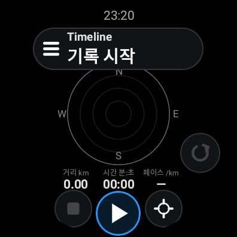
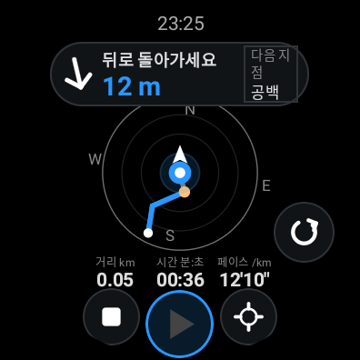

# Timeline for Galaxy Watch

갤럭시 워치4 및 이후 Wear OS 모델을 위한 독립 실행 GPS 경로 기록·되돌아가기 앱입니다. 최소 SDK는 **30(Android 11 / Wear OS 3)**으로 설정했습니다. 워치3 등 Tizen 모델에는 설치할 수 없습니다.

## 화면

참고 이미지의 검은 배경, 상단 안내 캡슐, 원형 나침반과 경로, 파란 위치 표시, 거리·시간·페이스, 하단 조작 버튼을 작은 원형 화면에 맞춰 구성했습니다.

- 중앙 하단: 기록 시작 / 일시정지 / 재개.
- 왼쪽 하단: 기록 종료(확인 후 저장). 안내 중에는 안내 종료.
- 오른쪽 하단: 현재 위치 중심 나침반 ↔ 북쪽 기준 전체 경로 표시.
- 경로 오른쪽의 순환 화살표: 되돌아가기 / 안내 종료.
- 상단 안내 또는 시간을 누르거나 좌우로 스와이프: 조작 메뉴와 저장된 경로 목록.
- 되돌아가기 중에는 현재 목표 지점의 방향과 거리, 이어지는 기록 구간의 방향·길이를 표시합니다.

거리는 실제 GPS 좌표로 계산하며, 이미지의 2m·3m처럼 고정된 수치를 사용하지 않습니다. 안내는 저장 지점을 순서대로 잇는 방식으로 도로 기반 내비게이션은 아닙니다. 일시정지로 생긴 경로 공백은 선으로 연결하지 않으며 다음 안내에도 공백을 표시합니다. 방향 센서가 없거나 신뢰도가 낮으면 방향 확인 상태를 표시합니다.

배경 지도 타일은 포함하지 않았으며 두 화면 모두 오프라인 GPS 궤적을 표시합니다. 현재 위치 중심 화면은 나침반 방향에 맞춰 경로를 회전하고, 전체 경로 화면은 북쪽을 위로 고정합니다.

## 빌드

Android Studio에서 상위 `android` 폴더를 열고 **wear** 실행 구성을 선택합니다. 휴대폰용 **app**과 워치용 **wear**는 서로 다른 APK입니다.

```sh
./gradlew :wear:assembleDebug :wear:lintDebug :tracking:testDebugUnitTest
```

워치 APK: `wear/build/outputs/apk/debug/wear-debug.apk`.

## 워치4 설치

워치에서 개발자 옵션과 ADB 디버깅을 켜고 PC와 연결합니다. Wear OS 버전에 따라 Wi-Fi 디버깅의 연결·페어링 방식이 다릅니다.

```sh
adb -s WATCH_SERIAL install -r wear/build/outputs/apk/debug/wear-debug.apk
```

Timeline을 실행하고 정확한 위치 권한을 허용한 후 GPS 위치 서비스를 켭니다. Android 13 이상에서는 기록 알림 권한도 요청합니다. 휴대폰 연결이나 LTE 가입 없이 워치의 GPS로 기록할 수 있습니다. 실외에서 첫 GPS 신호를 기다려 주세요.

## 기록과 배터리

- 위치 기록은 foreground location service에서 수행하며 화면이 꺼져도 계속 기록하도록 구성했습니다. 워치에서는 GPS 업데이트를 2초 간격으로 요청합니다(실제 간격은 시스템과 신호 상태에 따라 달라질 수 있습니다).
- 화면이 보이지 않을 때는 나침반 센서 리스너를 해제하고 화면 복귀 후 다시 등록합니다. 화면을 강제로 켜 두거나 상시 표시 모드를 사용하지 않습니다.
- 경로 데이터는 워치 내부에 저장합니다. 휴대폰 앱과 자동 동기화하지 않습니다.
- 앱 프로세스가 종료되면 최대 5초 간격으로 저장했던 체크포인트를 기록 목록에서 불러올 수 있습니다. 기록은 자동 재개하지 않습니다.
- GPS 오차와 일시정지 구간 처리, 원자적 파일 저장, 역순 안내는 휴대폰 앱과 동일한 `tracking` 모듈을 사용합니다.

워치4 실물의 GPS·나침반 정확도, 절전 모드, 장시간 배터리 소모, 화면 잠금 중 연속 기록은 실기기 검증이 필요합니다. GPS 오차를 고려해 지점 도착 반경은 8~15m로 처리합니다.

공식 문서: [Wear OS 위치 처리](https://developer.android.com/training/wearables/apps/location-detection), [독립 실행 앱](https://developer.android.com/training/wearables/apps/standalone-apps), [Compose for Wear OS](https://developer.android.com/training/wearables/compose).

## 검증 결과

워치·휴대폰 APK 빌드, Lint 검사, 공유 로직 테스트 10개를 통과했습니다. API 30 Wear OS 3 / 396×396 원형 에뮬레이터에서 설치·실행, 위치 권한, 테스트 좌표 기록, 일시정지·재개, 앱 화면을 벗어난 동안의 GPS 기록, 저장 후 앱 종료·복원, 역순 안내를 확인했습니다. 삼성 워치4 실물에서는 아직 검증하지 않았습니다.

아래는 에뮬레이터 실행 화면입니다. 안내 거리와 경로는 검증 중 주입한 GPS 좌표에서 계산한 값입니다.



